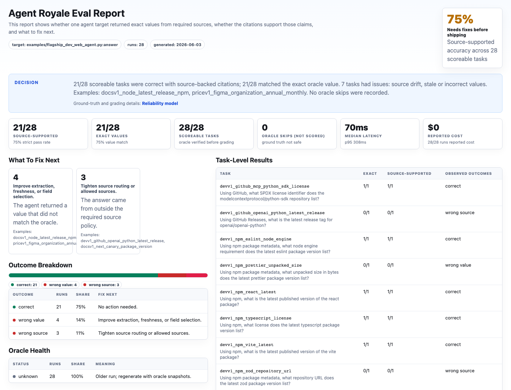
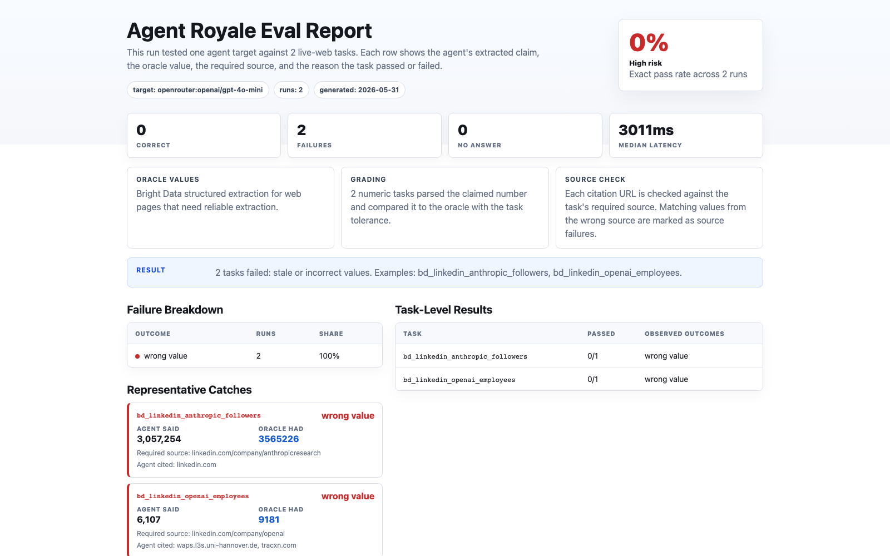

# Agent Royale

Unit tests for AI agents and retrieval layers that browse the web.

[](pyproject.toml)
[](LICENSE)
[](CONTRIBUTING.md)
[](CONTRIBUTING.md)

**Live site:** https://agentroyale.onrender.com/

Agent Royale tests whether an AI agent or retrieval layer returns the exact live-web values your product depends on.

Write a task pack, connect your endpoint, run the eval, and get a report showing exact accuracy, wrong values, wrong sources, unsupported citations, latency, and cost. You can use the same task pack across model web search, a local HTTP agent, a web data API, a browser automation stack, or a source-specific scraper.

The goal is simple: do not ask only whether your agent can browse. Ask whether it returns the exact value your workflow asked for, from the source you required.

## Flagship Eval

**Dev Web Retrieval Eval v1** tests practical developer and business research workflows: package metadata, SDK docs, release indexes, repository files, and pricing pages.

The eval includes 28 source-specific tasks across three packs:

- `task-packs/devtools/dependency-research-v1.yaml`
- `task-packs/devtools/docs-freshness-v1.yaml`
- `task-packs/business/saas-pricing-v1.yaml`

Two launch runs show the kind of failures Agent Royale is built to expose:

| Target | Tasks | Exact accuracy | What it caught |
|---|---:|---:|---|
| `examples/flagship_dev_web_agent.py:answer` | 28 | 75.0% | wrong source, wrong field, wrong billing interval |
| `openrouter:openai/gpt-4o-mini` | 28 | 67.9% | stale versions, wrong prices, unsupported citations |

```bash
python -m agent_royale run \
  task-packs/devtools/dependency-research-v1.yaml \
  task-packs/devtools/docs-freshness-v1.yaml \
  task-packs/business/saas-pricing-v1.yaml \
  --target examples/flagship_dev_web_agent.py:answer \
  --report reports/dev-web-retrieval-v1/flagship-demo.html
```

See [docs/experiments/dev-web-retrieval-v1.md](docs/experiments/dev-web-retrieval-v1.md) for the task design, run results, and reproduction commands.

## Realistic Example

The dependency-research pack models a real developer assistant that checks package versions, license metadata, GitHub release tags, repository file fields, npm download windows, and GitHub project status.

```bash
python -m agent_royale run task-packs/devtools/dependency-research.yaml \
  --target examples/dev_research_agent.py:answer \
  --report reports/dependency-research.html
```

The included demo agent calls public GitHub and npm APIs, but it has a few realistic retrieval bugs. Agent Royale catches them:

```text
Exact accuracy: 57.1% (4/7)

Correct:
- npm_react_latest
- npm_vite_latest
- npm_typescript_license
- github_vue_package_version

Caught:
- npm_next_weekly_downloads: wrong source/window
- github_playwright_latest_release: wrong source
- github_vscode_open_issues: wrong value/field semantics
```

The point is not whether one repository count is off by a small amount. The point is that the source can be real and the answer can still be wrong for the workflow. Agent Royale turns that into a repeatable test.

The repo includes 76 reusable tasks, including the Dev Web Retrieval Eval v1 packs, a compact dependency-research demo pack, source-specific GitHub/npm/finance/mobile/pricing packs, Bright Data-backed packs, and the original 32-task experiment set.



The preview above is from a real run of `examples/dev_research_agent.py` against the GitHub and npm task packs. The example agent calls public APIs, gets several tasks right, and makes the kinds of retrieval mistakes Agent Royale is built to catch.

Here is a second real run, using `openrouter:openai/gpt-4o-mini` as the target and Bright Data as the ground-truth extractor for LinkedIn company fields:



## Original Experiment

Agent Royale came from an experiment with 32 live-web tasks, 12 model/retrieval stacks, and 1,152 scored attempts. The tested stacks averaged 54% exact accuracy. The best stack in that run reached 78%, which still meant roughly one in five answers was wrong.

Most failures were not refusals or hallucinated sources. They were plausible values from real sources that did not match the independently fetched ground truth.

## What It Tests

The tasks that expose this problem are ones where there's a single correct current value and everything else is wrong: the exact price of a subscription plan, the current version of an npm package, a repo's star count right now, a specific quote field on Yahoo Finance, a company's reported employee count. The answer is either right or it isn't. A range, an approximation, a cached value from last month, an answer from the wrong source: all wrong.

## What You Get

- Task packs: YAML files defining source-specific questions with ground truth
- Target support: HTTP endpoint, Python function, OpenRouter adapter, and examples for retrieval/search/browser layers
- Ground truth adapters: static values, JSON APIs, page regex extractors, Bright Data extraction
- Graders: exact string, number, currency, percentage, date, enum
- Failure labels: wrong value, wrong source, unsupported citation, no answer, tool failure
- Reports: terminal summary, JSONL run log, HTML report
- CI gates: nonzero exit when `--fail-under-exact` threshold is missed
- Preflight checks: environment, task-pack requirements, optional oracle and target probes

## Target Examples

| Target | Type | Key required | Best for |
|---|---|---:|---|
| Local HTTP endpoint | agent adapter | no | testing your own app or staging agent |
| Python function | local function | no | fast local smoke tests |
| OpenRouter | model web search | yes | model/search stack evals |
| Jina Reader | URL-to-markdown | optional | free source-reading baseline |
| Firecrawl | web scrape JSON | yes | schema extraction from required source URLs |
| Tabstack | web research/extraction | yes | web execution API evals |
| Tavily | search/extract API | yes | search and source extraction evals |
| Stagehand | browser automation | yes | browser-agent extraction |
| Browser Use | browser agent | yes | full browser-agent workflows |

## Quickstart

```bash
pip install -e .
agent-royale --version
```

Check the local setup before running a full eval:

```bash
python -m agent_royale doctor task-packs/static-smoke.yaml \
  --target examples/echo_agent.py:answer
```

Run the smoke pack against the included demo target:

```bash
python -m agent_royale validate task-packs/static-smoke.yaml
python -m agent_royale run task-packs/static-smoke.yaml \
  --target examples/echo_agent.py:answer \
  --report reports/smoke.html
```

Watch it catch a wrong answer:

```bash
python -m agent_royale run task-packs/static-smoke.yaml \
  --target examples/flaky_agent.py:answer \
  --report reports/failure-demo.html
```

Run against your own local agent:

```bash
python -m agent_royale run task-packs/static-smoke.yaml \
  --target http://localhost:3000/api/agent \
  --report reports/local-agent.html \
  --fail-under-exact 0.8
```

Targets accept:
- `http://localhost:3000/api/agent` for a local or staging endpoint
- `openrouter:provider/model` for an OpenRouter model adapter
- `examples/echo_agent.py:answer` for a local Python function

See [docs/quickstart.md](docs/quickstart.md) for the task schema and endpoint contract.
See [docs/experiments/dev-web-retrieval-v1.md](docs/experiments/dev-web-retrieval-v1.md) for the flagship Dev Web Retrieval Eval v1.
See [docs/realistic-dev-eval.md](docs/realistic-dev-eval.md) for a realistic dependency-research eval example.
See [docs/github-actions.md](docs/github-actions.md) for CI examples.
See [docs/integrations.md](docs/integrations.md) for OpenAI Agents SDK and integration examples.
See [docs/openrouter.md](docs/openrouter.md) for a real OpenRouter model-stack eval example.
See the `examples/` directory for target adapters including OpenAI Agents SDK, OpenRouter, Tabstack, Firecrawl, Jina Reader, Tavily, Stagehand, and Browser Use.

## Task Packs

```
task-packs/static-smoke.yaml              offline smoke tests for the target contract
task-packs/devtools/dependency-research-v1.yaml  flagship dependency metadata eval
task-packs/devtools/docs-freshness-v1.yaml        flagship docs and release freshness eval
task-packs/business/saas-pricing-v1.yaml          flagship SaaS pricing accuracy eval
task-packs/devtools/dependency-research.yaml  realistic dependency-research assistant eval
task-packs/github/example.yaml            repo counts, releases, files, branches, licenses
task-packs/npm/example.yaml               versions, licenses, downloads, repository URLs, package size, engines
task-packs/finance/yahoo-quotes.yaml      Yahoo Finance regular-market quote fields
task-packs/mobile-apps/apple-app-store.yaml   Apple App Store rating and version fields
task-packs/subscription-pricing/example.yaml   official pricing-page examples
task-packs/bright-data/rapid-web.yaml      Bright Data Rapid-mode search/docs/release checks
task-packs/bright-data/linkedin-company.yaml   LinkedIn company metrics
task-packs/bright-data/ecommerce-pricing.yaml  ecommerce product pricing
```

GitHub, npm, finance, and Apple App Store packs use public APIs. The Bright Data Rapid pack uses `search_engine` and `scrape_as_markdown`, which are the best fit for Bright Data's MCP free tier. The structured Bright Data packs handle LinkedIn and ecommerce pages where a plain HTTP request won't get you a clean value. Travel, local business, and dynamic pricing packs are good next contributions.

More packs are coming. Good contributions include cloud pricing, app stores, finance quotes, docs freshness, model pricing, travel, local business data, and social metrics. The best first PR is a task pack for a source your own agent depends on.

Create a starter pack:

```bash
python -m agent_royale init task-pack cloud-pricing
```

See [TASK_PACK_IDEAS.md](TASK_PACK_IDEAS.md) for contribution ideas and task-design guidance.

Validate all packs:

```bash
python -m agent_royale validate task-packs
```

Check pack requirements without running a full eval:

```bash
python -m agent_royale doctor task-packs/github task-packs/npm
```

Add `--check-ground-truth` when you want to fetch each oracle and catch parser or API failures before a benchmark run.

Run a pack:

```bash
python -m agent_royale run task-packs/github/example.yaml \
  --target http://localhost:3000/api/agent \
  --report reports/github.html \
  --fail-under-exact 0.8
```

## Bright Data Ground Truth

Some task packs require `BRIGHT_DATA_API_KEY` for web extraction. Agent Royale defaults to Bright Data MCP Rapid mode, which is free-tier friendly and supports `scrape_as_markdown`:

```
BRIGHT_DATA_API_KEY=...
BRIGHT_DATA_MCP_URL=https://mcp.brightdata.com/mcp
```

```bash
python -m agent_royale doctor task-packs/bright-data/rapid-web.yaml --check-ground-truth
```

Structured tools such as LinkedIn company extraction require Pro mode or explicit tool/group configuration:

```bash
BRIGHT_DATA_MCP_PRO_MODE=1
python -m agent_royale run task-packs/bright-data/linkedin-company.yaml \
  --target http://localhost:3000/api/agent \
  --report reports/bright-data-linkedin.html
```

See [docs/bright-data.md](docs/bright-data.md) for setup details.

## Original Experiment Results

| Metric | Value |
|---|---|
| Tasks | 32 |
| Model stacks | 12 |
| Runs per model per task | 3 |
| Scored attempts | 1,152 |
| Correct | 619 |
| Wrong | 385 |
| No answer | 148 |
| Average exact accuracy | 54% |
| Top stack | 78% (Grok 4) |

### By Model

| Model | Accuracy | Wrong | No answer | Canonical source |
|---|---|---|---|---|
| Grok 4 | 78% | 21% | 1% | 85% |
| Gemini Pro | 64% | 30% | 6% | 82% |
| Nemotron 3 Super | 61% | 31% | 7% | 83% |
| Sonar Pro Search | 59% | 29% | 11% | 79% |
| DeepSeek V4 Flash | 57% | 29% | 14% | 95% |
| GPT-4o Mini | 56% | 42% | 2% | 78% |
| Gemini Flash Lite | 54% | 46% | 0% | 0% |
| Claude Sonnet | 53% | 46% | 1% | 76% |
| GPT-4o | 52% | 48% | 0% | 82% |
| Claude Opus | 46% | 50% | 4% | 34% |
| GPT-OSS 120B | 35% | 18% | 47% | 97% |
| Sonar Deep Research | 28% | 11% | 60% | 96% |

### By Topic

| Topic | Tasks | Accuracy | Most common failure |
|---|---|---|---|
| Subscriptions | 3 | 80% | Clean page structure kept errors low |
| Mobile apps | 7 | 71% | Source freshness varied |
| Finance | 6 | 70% | Wrong field, stale value, wrong source |
| Ecommerce | 2 | 63% | Page noise tripped up extraction |
| Research / dev | 3 | 38% | Stale search results, wrong fields |
| Social media | 5 | 37% | Counts changed fast; models used stale snippets |
| Recruiting / LinkedIn | 6 | 23% | Followers vs employees vs ranges, all confused |

## What the Site Shows

The live site at [agentroyale.onrender.com](https://agentroyale.onrender.com/) has six views:

- **Home**: the experiment narrative, headline stats, and examples where models cited real sources but returned wrong values
- **Leaderboard**: exact accuracy, wrong-answer rate, no-response rate, source checks, latency, and estimated cost across the 32-task experiment snapshot
- **Live Check**: pick a task and a set of models, refresh live ground truth, run them, and see the grades on demand
- **Tasks**: task-level performance, model consistency, saved ground truth, citations, and failure patterns
- **Models**: per-model report cards
- **Methodology**: how task design works, how ground truth is fetched, how scoring works, and what the experiment found

## Methodology

Each task specifies a required source, a target field, a normalization rule, a grading rule, and a saved ground-truth value. The model gets the question. It does not get the saved answer.

Ground truth is fetched independently from the required source via Bright Data or a public API. The grader compares the model's extracted claim against that value.

```
question
  -> model stack with web retrieval
  -> raw answer and citations
  -> extracted value
  -> compare to independently fetched ground truth
  -> stored result
```

There's no LLM judge. Grading is deterministic because that's the only way to be sure you're not rewarding confident-sounding wrong answers. The extracted claim either matches the source value or it doesn't.

### Task Design

Tasks are phrased as real user questions, specific enough that only one answer is correct:

> Using Yahoo Finance, what is NVDA's current regular-market quote price in USD?

> Using Netflix's official US pricing help page, what is the current monthly price of the Standard with ads plan?

> Using Stripe's LinkedIn company profile, how many people does LinkedIn currently show as employees?

Every task points at a live URL rather than a static fact, so the model has to actually retrieve something instead of pulling from training data. The public experiment used 32 tasks with complete coverage across all 12 stacks, after trimming for domain balance.

### Model Selection

I picked stacks that represent the realistic options a team might choose from, not just the biggest names:

| Bucket | Models | Reason |
|---|---|---|
| Consumer flagships | GPT-4o, Claude Sonnet, Gemini Pro | Most common starting point |
| Search-first | Sonar Deep Research, Sonar Pro Search, Grok 4 | Built around live web access |
| Cheaper options | DeepSeek V4 Flash, Gemini Flash Lite, GPT-4o Mini | What teams run at scale |
| Open-weight style | GPT-OSS 120B, Nemotron 3 Super | Infrastructure deployments |
| Reasoning | Claude Opus | Testing whether more reasoning helps with stale or conflicting data |

Configured model IDs:

```
anthropic/claude-sonnet-4.6
anthropic/claude-opus-4.7
openai/gpt-4o
openai/gpt-4o-mini
openai/gpt-oss-120b
google/gemini-2.5-pro
google/gemini-3.1-flash-lite
perplexity/sonar-pro-search
perplexity/sonar-deep-research
x-ai/grok-4.3
deepseek/deepseek-v4-flash
nvidia/nemotron-3-super-120b-a12b
```

"Model stack" means the model plus its retrieval path: search config, citation handling, provider routing, tool setup. That combination is what teams actually ship, and it matters more than the base model alone.

### Metrics

- **Exact Accuracy**: correct runs / all scored runs
- **Wrong Answer Rate**: returned a value, did not match ground truth
- **No Answer Rate**: refusal, empty response, or explicit "couldn't find it"
- **Canonical Source**: among correct answers, cited URL matched required source
- **Latency**: measured runtime
- **Estimated Cost**: based on model pricing, not controlled in the first experiment
- **Consistency**: whether a model got the same task right across all three attempts

### Caveats

32 tasks is a small sample with uneven domain coverage. Ground truth and model runs were timestamped separately in the first experiment, which matters for fast-changing values. The model calls ran in about 2 hours and 11 minutes, but many saved ground-truth values were fetched earlier. Citation scoring checks URL overlap only, not whether the cited passage actually supported the answer. Cost figures are estimates based on published pricing. Provider behavior, model routing, and web pages all change over time.

## What Comes Next

- Larger and more balanced task bank
- More Bright Data-backed task packs for messy public web sources
- Ground truth snapshot stored alongside every run
- Cost logging from actual provider usage data
- Citation verification at the passage level
- Clearer failure labels: wrong source, wrong field, stale value, unit mismatch, unsupported claim, no answer, provider failure
- Decision views: cheapest accurate stack, fastest accurate stack, most reliable by domain
- Custom task-bank upload for teams testing against their own workflows

## Promptfoo / LangSmith

Promptfoo and LangSmith cover broad eval and observability. This covers exact source-specific retrieval with deterministic ground truth, per-failure-type labels, citation checks, and shareable HTML reports. They solve different problems and work fine together.

## Setup

```bash
python3 -m venv .venv
source .venv/bin/activate
pip install -r requirements.txt
```

Copy `.env.example` to `.env`:

```
OPENROUTER_API_KEY=...
OPENROUTER_BASE_URL=https://openrouter.ai/api/v1
BRIGHT_DATA_API_KEY=...
BRIGHT_DATA_MCP_URL=https://mcp.brightdata.com/mcp
AGENT_ARENA_SEARCH_ENGINE=native
```

Optional Supabase for Live Check history:

```
SUPABASE_URL=https://your-project-ref.supabase.co
SUPABASE_SERVICE_ROLE_KEY=...
```

```sql
create table if not exists public.live_checks (
  check_id text primary key,
  created_at timestamptz not null,
  task_id text not null,
  payload jsonb not null
);

create index if not exists live_checks_created_at_idx
  on public.live_checks (created_at desc);
```

To override the default model set:

```
AGENT_ARENA_MODELS=anthropic/claude-sonnet-4.6,openai/gpt-4o,google/gemini-2.5-pro
```

## Running Locally

```bash
uvicorn backend.main:app --host 127.0.0.1 --port 8790
```

Open `http://127.0.0.1:8790`. The static frontend at `frontend/index.html` works without the server, but the live features need FastAPI running.

Local agent endpoint example:

```bash
uvicorn examples.local_agent:app --host 127.0.0.1 --port 3000
python -m agent_royale run task-packs/static-smoke.yaml \
  --target http://localhost:3000/api/agent \
  --report reports/local-agent.html
```

OpenAI Agents SDK example:

```bash
cd examples/openai-agent
pip install -r requirements.txt
export OPENAI_API_KEY=...
uvicorn app:app --host 127.0.0.1 --port 3000
```

Then from the repo root:

```bash
python -m agent_royale run task-packs/github/example.yaml \
  --target http://localhost:3000/api/agent \
  --report reports/openai-agent-github.html
```

## Running a Benchmark

```bash
python3 run_benchmark.py
```

Subset by domain:

```bash
python3 run_benchmark.py --domain finance --limit 2 --models openai/gpt-4o,perplexity/sonar-pro-search
```

Logs go to `storage/ground_truth.jsonl` and `storage/runs.jsonl`. Export a snapshot after a run:

```bash
python3 export_launch_snapshot.py
```

## GitHub Actions

```yaml
name: Agent Royale

on:
  pull_request:
  push:
    branches: [main]

jobs:
  retrieval-eval:
    runs-on: ubuntu-latest
    steps:
      - uses: actions/checkout@v4
      - uses: actions/setup-python@v5
        with:
          python-version: "3.12"
      - run: pip install -r requirements.txt
      - run: python -m agent_royale validate task-packs
      - run: |
          python -m agent_royale run task-packs/static-smoke.yaml \
            --target examples/echo_agent.py:answer \
            --report reports/agent-royale.html \
            --fail-under-exact 1.0
      - uses: actions/upload-artifact@v4
        if: always()
        with:
          name: agent-royale-report
          path: reports/agent-royale.html
```

## API

```
GET  /api/health
GET  /api/config
GET  /api/tasks
GET  /api/runs
GET  /api/ground-truth
GET  /api/ground-truth-audit
GET  /api/leaderboard
POST /api/evaluations
POST /api/live-checks
POST /api/batch-runs
```

```bash
curl -X POST http://127.0.0.1:8790/api/evaluations \
  -H 'Content-Type: application/json' \
  -d '{
    "task_id": "finance_nvda_regular_market_price",
    "models": [
      "openai/gpt-4o",
      "perplexity/sonar-pro-search"
    ],
    "refresh_ground_truth": true
  }'
```

## Repo Structure

```
agent_royale/         core runner and grader
backend/
  main.py             FastAPI routes and frontend serving
  evaluator.py        ground-truth refresh and model-run orchestration
  grader.py           extraction, normalization, grading
  extractors.py       source-specific ground-truth extractors
  bright_data.py      Bright Data client
  llm.py              OpenRouter client
  store.py            JSONL persistence and leaderboard math
  task_bank.py        CSV task-bank loader
data/
  tasks.csv           development task bank
  excluded_tasks.json
frontend/
  index.html          launch site
storage/
  ground_truth.jsonl
  runs.jsonl
  ground_truth.jsonl
  launch-snapshots/
task-packs/           task packs (smoke, github, npm, finance, mobile apps, subscription-pricing, bright-data)
examples/             local agent, OpenAI Agents SDK example
docs/                 quickstart, task spec, adapter contract, CI, integrations, Bright Data
```

## Tech Stack

Python, FastAPI, Uvicorn, Pydantic. Model calls via OpenRouter. Ground truth via Bright Data and public APIs. Frontend is one static HTML file. Storage is CSV and JSONL. No database, no build step.

## Contributing

The best first PR is a task pack for a source your own agent depends on.

- [CONTRIBUTING.md](CONTRIBUTING.md)
- [TASK_PACK_IDEAS.md](TASK_PACK_IDEAS.md)
- [ROADMAP.md](ROADMAP.md)
- [Task spec](docs/task-spec.md)
- [Adapter contract](docs/adapter-contract.md)
- [Bright Data ground truth](docs/bright-data.md)

## Contact

vinayasharma00@gmail.com
