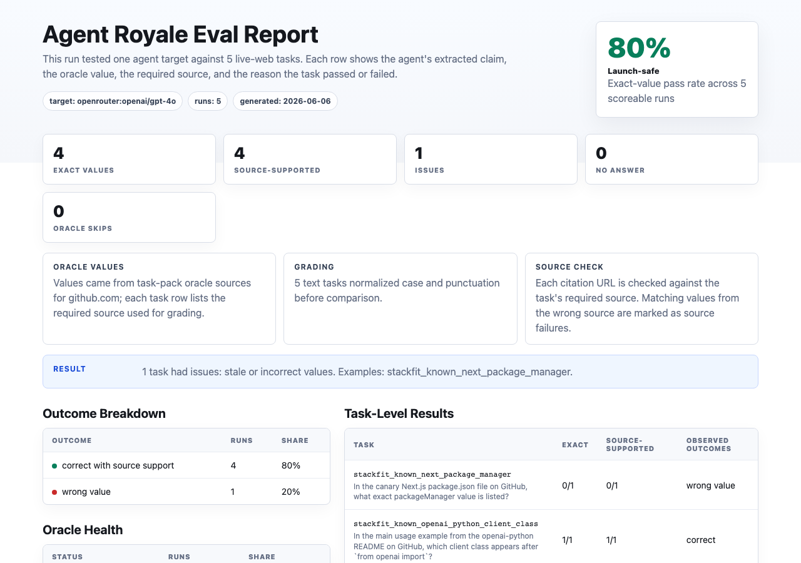
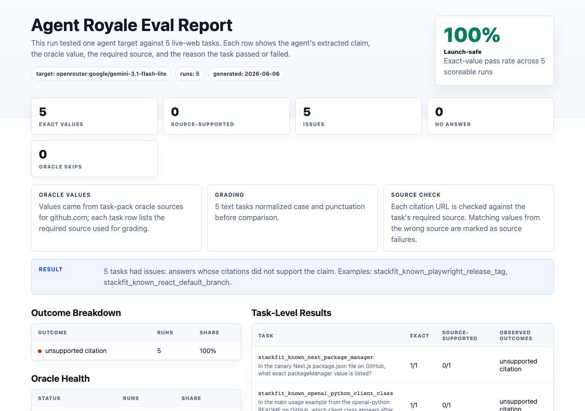
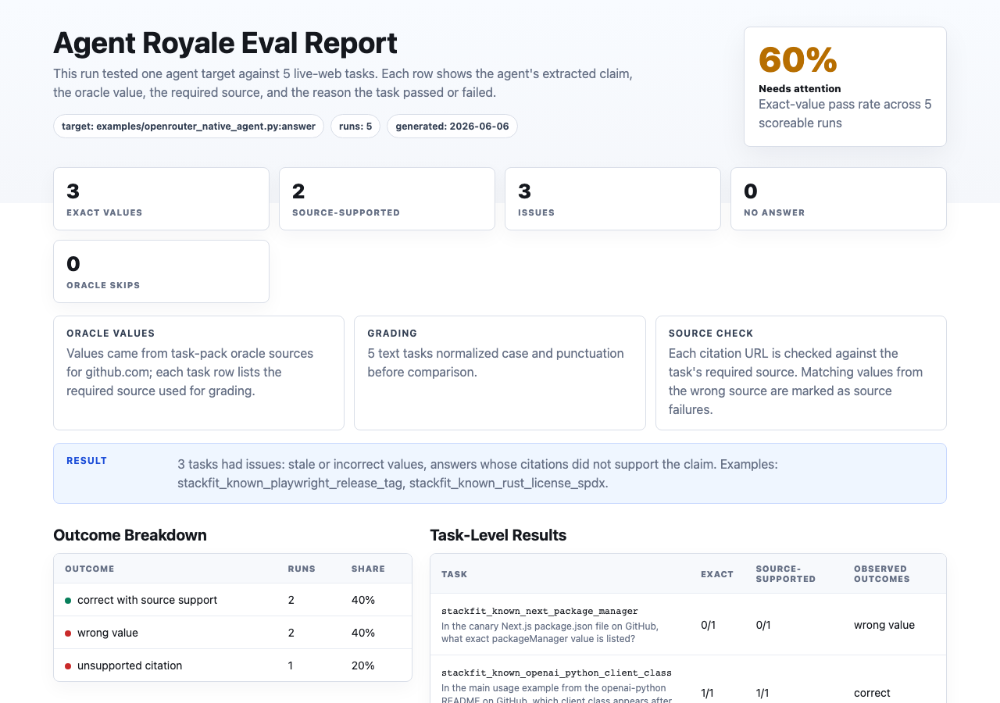

# OpenRouter Model Comparison v1

This experiment compares three OpenRouter model-search stacks on the same expanded known-source reading pack.

The goal is not to rank model providers universally. The goal is to show how Agent Royale catches different failure modes across model-search stacks: wrong exact value, no answer, missing source support, and adapter compatibility.

## Task Pack

All models ran against:

[`known-source-reading.yaml`](../../task-packs/experiments/web-retrieval-stack-fit-v1/known-source-reading.yaml)

The five tasks ask for exact values from required public sources:

- the main OpenAI Python README client class
- the latest Playwright GitHub release tag
- the canary Next.js `packageManager` value
- the facebook/react default branch
- the rust-lang/rust SPDX license identifier

## Models

| Family | OpenRouter target | Mode |
|---|---|---|
| OpenAI | `openrouter:openai/gpt-4o` | OpenRouter web-search tool |
| Google | `openrouter:google/gemini-3.1-flash-lite` | OpenRouter web-search tool |
| Perplexity | `perplexity/sonar-pro-search` through [`examples/openrouter_native_agent.py`](../../examples/openrouter_native_agent.py) | Native model-search behavior |

Perplexity is run through the native adapter because the `perplexity/sonar-pro-search` route did not expose an endpoint that supports the OpenRouter web-search tool path during this run.

## Results

| Model | Exact | Source-supported | Report |
|---|---:|---:|---|
| OpenAI GPT-4o | 4/5 | 4/5 | [`openai-gpt-4o-known-source.html`](../../reports/openrouter-model-comparison-v1/openai-gpt-4o-known-source.html) |
| Gemini 3.1 Flash-Lite | 5/5 | 0/5 | [`google-gemini-3-1-flash-lite-known-source.html`](../../reports/openrouter-model-comparison-v1/google-gemini-3-1-flash-lite-known-source.html) |
| Perplexity Sonar Pro Search | 3/5 | 2/5 | [`perplexity-sonar-pro-search-native-known-source.html`](../../reports/openrouter-model-comparison-v1/perplexity-sonar-pro-search-native-known-source.html) |







## What The Eval Caught

OpenAI GPT-4o got four exact values right and missed the exact Next.js `packageManager` value.

Gemini 3.1 Flash-Lite returned all five exact values, but none passed the source-support check. That is an important distinction: exact answers without inspectable citation support may still be risky for production retrieval workflows.

Perplexity Sonar Pro Search got three exact values right. It missed the Playwright release tag and the Next.js `packageManager` value, and one otherwise-correct license answer lacked source support.

## Interpretation

This is a workflow eval, not a general model leaderboard.

The useful finding is that model-search stacks fail differently:

- one can be mostly exact but miss a nested file value
- one can answer exactly while failing source-support checks
- one can be search-native but still return stale exact values
- adapter compatibility matters when a model route does not support the same tool-calling path as another route

Agent Royale makes those differences visible before a team ships the retrieval stack.

## Reproduce

OpenAI:

```bash
OPENROUTER_API_KEY=...
python -m agent_royale run \
  task-packs/experiments/web-retrieval-stack-fit-v1/known-source-reading.yaml \
  --target openrouter:openai/gpt-4o \
  --output runs/openrouter-model-comparison-v1/openai-gpt-4o-known-source.jsonl \
  --report reports/openrouter-model-comparison-v1/openai-gpt-4o-known-source.html
```

Gemini:

```bash
OPENROUTER_API_KEY=...
python -m agent_royale run \
  task-packs/experiments/web-retrieval-stack-fit-v1/known-source-reading.yaml \
  --target openrouter:google/gemini-3.1-flash-lite \
  --output runs/openrouter-model-comparison-v1/google-gemini-3-1-flash-lite-known-source.jsonl \
  --report reports/openrouter-model-comparison-v1/google-gemini-3-1-flash-lite-known-source.html
```

Perplexity:

```bash
OPENROUTER_API_KEY=...
OPENROUTER_NATIVE_MODEL=perplexity/sonar-pro-search \
python -m agent_royale run \
  task-packs/experiments/web-retrieval-stack-fit-v1/known-source-reading.yaml \
  --target examples/openrouter_native_agent.py:answer \
  --output runs/openrouter-model-comparison-v1/perplexity-sonar-pro-search-native-known-source.jsonl \
  --report reports/openrouter-model-comparison-v1/perplexity-sonar-pro-search-native-known-source.html
```
