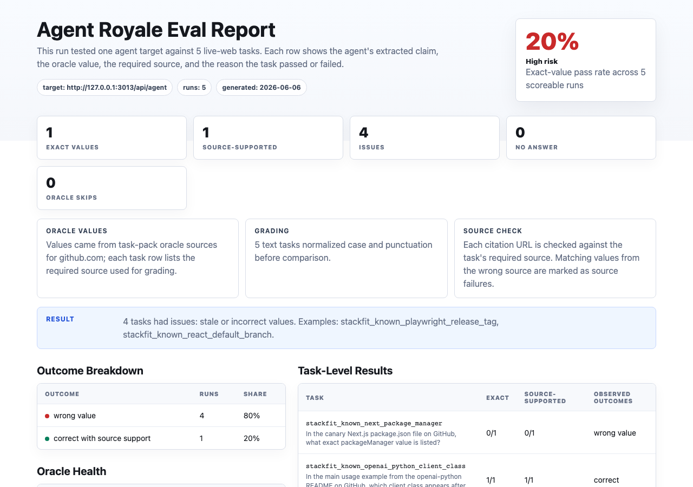
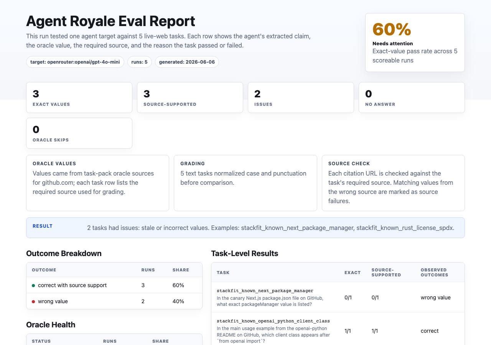

# Search Is Not Reading v1

Developers often ask which web search API is best for an agent stack. This experiment tests a more practical question:

> Is the stack being used for search, source reading, or exact field extraction?

The answer matters because those are different jobs. A search endpoint can find plausible pages but still fail to return the exact value from the required source. A scrape/extract endpoint can be a better fit when the URL is already known. A model-search stack can work well, but still needs task-specific verification.

## Setup

All targets were run against the same known-source reading pack:

[`known-source-reading.yaml`](../../task-packs/experiments/web-retrieval-stack-fit-v1/known-source-reading.yaml)

The pack asks for exact values from required public sources:

- the main OpenAI Python README client class
- the latest Playwright GitHub release tag
- the canary Next.js `packageManager` value
- the facebook/react default branch
- the rust-lang/rust SPDX license identifier

## Results

| Target | Retrieval mode | Exact | Source-supported | Report |
|---|---|---:|---:|---|
| Jina Reader adapter | URL reader | 5/5 | 5/5 | [`jina-known-source-reading.html`](../../reports/stack-fit-v1/jina-known-source-reading.html) |
| Firecrawl adapter | Scrape/extract | 5/5 | 5/5 | [`firecrawl-known-source-reading.html`](../../reports/stack-fit-v1/firecrawl-known-source-reading.html) |
| Tavily extract adapter | URL extract | 4/5 | 3/5 | [`tavily-known-source-extract.html`](../../reports/stack-fit-v1/tavily-known-source-extract.html) |
| Tavily search adapter | Search | 1/5 | 1/5 | [`tavily-search-known-source.html`](../../reports/stack-fit-v1/tavily-search-known-source.html) |
| OpenRouter GPT-4o Mini | Model-search stack | 3/5 | 3/5 | [`openrouter-known-source-reading.html`](../../reports/stack-fit-v1/openrouter-known-source-reading.html) |

## Main Finding

The most interesting result is within the same provider:

| Comparison | Exact | Source-supported | Median latency |
|---|---:|---:|---:|
| Tavily search | 20.0% | 20.0% | 2262 ms |
| Tavily extract | 80.0% | 60.0% | 392 ms |

See the generated comparison report:

[`tavily-search-vs-extract.md`](../../reports/stack-fit-v1/tavily-search-vs-extract.md)

This does not mean one endpoint is universally better. It means the retrieval mode must match the task. For known-source exact-value extraction, the extract endpoint was a better fit than the search endpoint in this run.

## Product Implication

Agent Royale should be positioned as an eval layer for retrieval architecture, not just a benchmark for models or vendors.

Useful product questions it can answer:

- Should this agent use search, extract, scrape, browser automation, or a full model-search stack?
- Did a prompt or endpoint change improve exact-value accuracy?
- Are returned values supported by the required source?
- Which failure mode is happening: wrong value, wrong source, unsupported citation, no answer, tool failure, or oracle ambiguity?

## Next Providers To Add

The thread that motivated this experiment mentioned several search and retrieval APIs that developers compare in practice. Good next adapters or target runs would be:

- Perplexity API for answer-with-citations research
- Exa for neural/web search
- Scrapfly for SERP plus page content in one workflow
- SerpAPI or Google Programmable Search Engine as traditional search baselines
- Bing Search API as an enterprise search baseline

Each should be tested by lane, not as a universal leaderboard.
