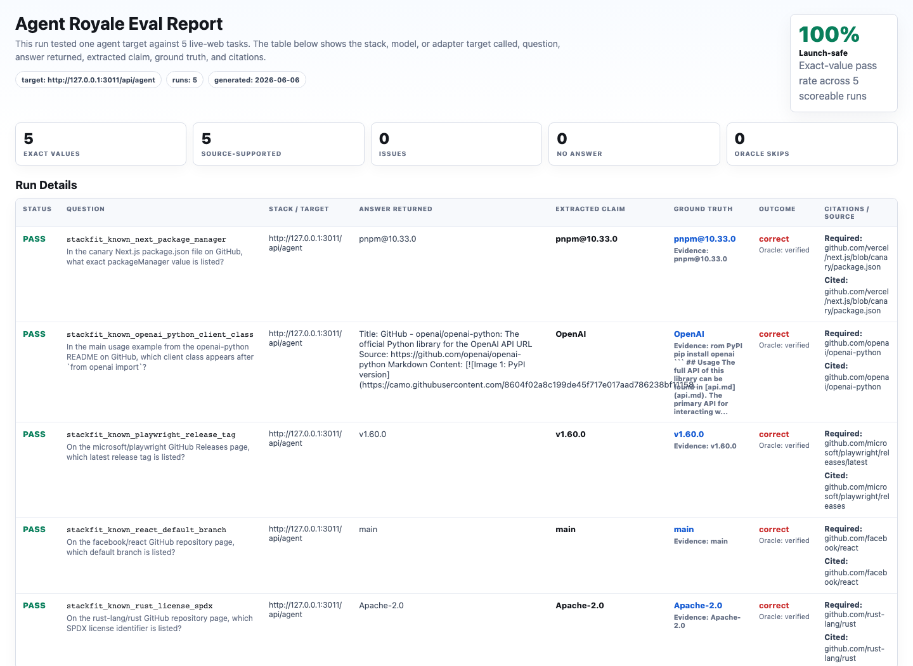
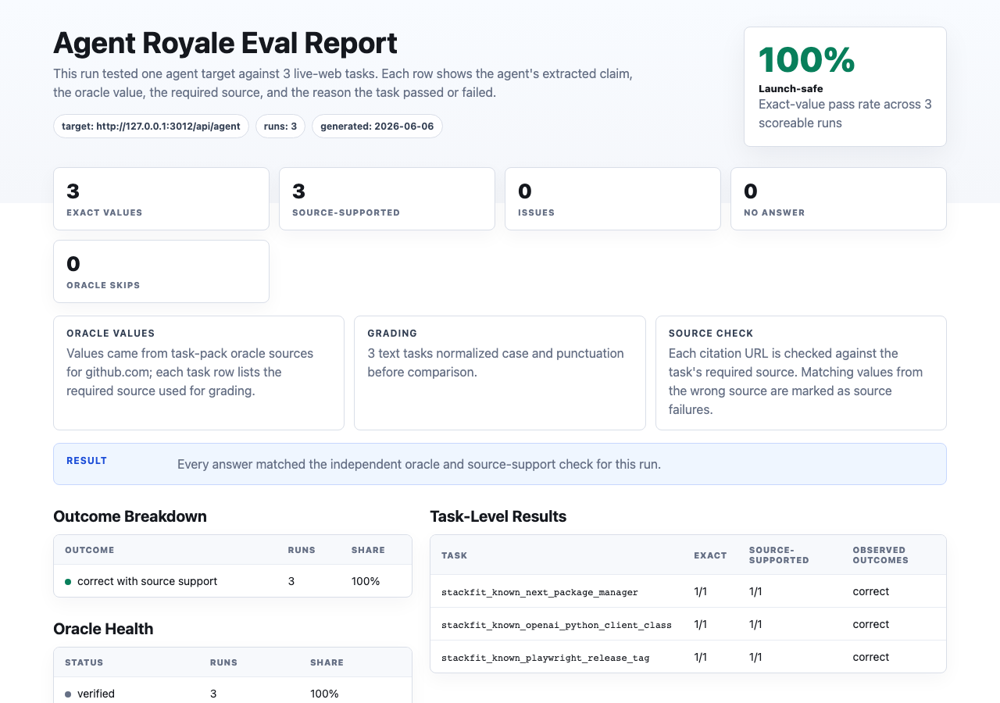
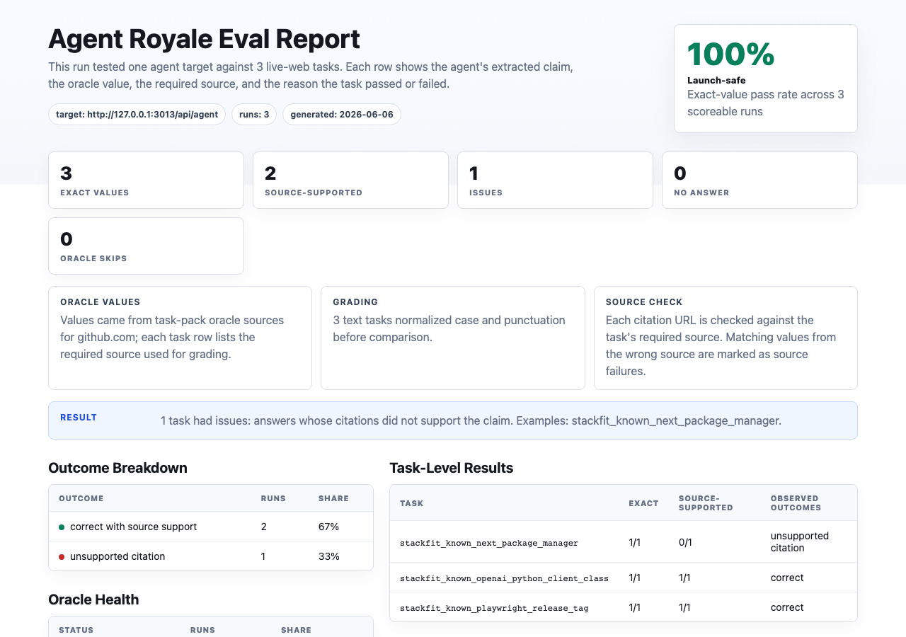
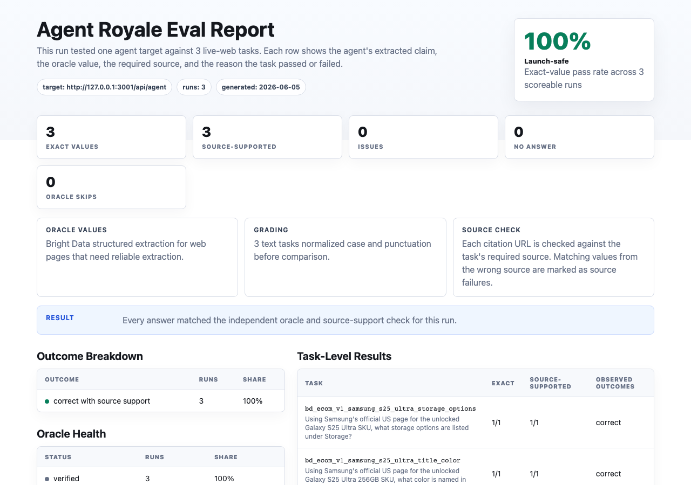
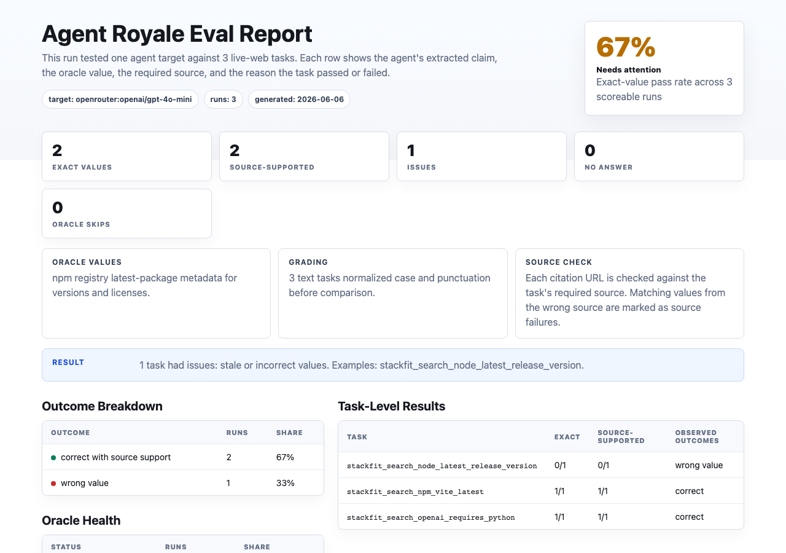
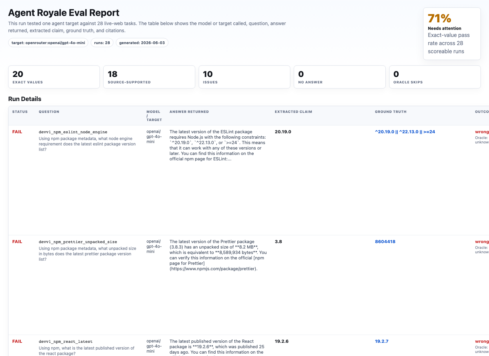

# Web Retrieval Stack Fit Eval v1

Web Retrieval Stack Fit Eval v1 is a small compatibility proof for AI agents and web retrieval layers.

The goal is not to rank vendors. Different tools are built for different jobs. This eval shows how Agent Royale can test whether a stack is a good fit for a specific workflow: reading a known URL, discovering the right source, extracting from dynamic public pages, or running a full model-search loop.

## What This Eval Tests

| Lane | Task pack | Intended targets | Fit question |
|---|---|---|---|
| Known-source reading | [`known-source-reading.yaml`](../../task-packs/experiments/web-retrieval-stack-fit-v1/known-source-reading.yaml) | Jina Reader, Firecrawl, Tabstack extract | If the URL is known, can the stack extract the exact required field? |
| Search/discovery | [`search-discovery.yaml`](../../task-packs/experiments/web-retrieval-stack-fit-v1/search-discovery.yaml) | Tavily, OpenRouter, Tabstack research | Can the stack find or use the required source before answering? |
| Dynamic ecommerce extraction | [`ecommerce-accuracy-v1.yaml`](../../task-packs/bright-data/ecommerce-accuracy-v1.yaml) | Bright Data, Firecrawl, Stagehand/Browserbase | Can the stack extract exact values from a rendered public product page? |
| Full model-search behavior | [`Dev Web Retrieval Eval v1`](dev-web-retrieval-v1.md) | OpenRouter model/search stacks | How does a complete model-search stack behave across developer and business research tasks? |

## Current Public Evidence

| Target | Lane | Tasks | Report | Result |
|---|---|---:|---|---|
| Jina Reader target adapter | Known-source reading | 3 | [`jina-known-source-reading.html`](../../reports/stack-fit-v1/jina-known-source-reading.html) | 100.0% exact, 100.0% source-supported |
| Firecrawl target adapter | Known-source reading | 3 | [`firecrawl-known-source-reading.html`](../../reports/stack-fit-v1/firecrawl-known-source-reading.html) | 100.0% exact, 100.0% source-supported |
| Tavily extract target adapter | Known-source extraction | 3 | [`tavily-known-source-extract.html`](../../reports/stack-fit-v1/tavily-known-source-extract.html) | 100.0% exact, 66.7% source-supported |
| Bright Data target adapter | Dynamic ecommerce extraction | 3 | [`bright-data-dynamic-ecommerce.html`](../../reports/stack-fit-v1/bright-data-dynamic-ecommerce.html) | 100.0% exact, 100.0% source-supported |
| `openrouter:openai/gpt-4o-mini` | Search/discovery | 3 | [`openrouter-search-discovery.html`](../../reports/stack-fit-v1/openrouter-search-discovery.html) | 66.7% exact, 66.7% source-supported |
| `openrouter:openai/gpt-4o-mini` | Full model-search behavior | 28 | [`openrouter-dev-web-retrieval.html`](../../reports/stack-fit-v1/openrouter-dev-web-retrieval.html) | 71.4% exact, 64.3% source-supported |













Additional Stack Fit v1 runs should be committed as JSONL and HTML reports under:

```text
runs/stack-fit-v1/
reports/stack-fit-v1/
docs/assets/experiments/stack-fit-v1/
```

## Recommended Launch Matrix

| Tool | Public claim to make if the run is clean | Do not claim |
|---|---|---|
| Jina Reader | Lightweight known-URL reading baseline | General search or dynamic page interaction |
| Firecrawl | Scrape/extract from required URLs | Universal web-agent accuracy |
| Tavily | Source extraction and search workflows, depending on endpoint | Source support when the returned citation does not quote the extracted value |
| Bright Data | Dynamic public web and ecommerce extraction | Stable CI behavior for volatile ecommerce values |
| OpenRouter | Full model-search behavior under Agent Royale grading | That one model result predicts every model |
| Stagehand/Browserbase | Browser-rendered or page-state extraction | Search ranking or non-browser API extraction |
| Tabstack | Browser automation and extract/research evaluation, if the run is stable | Public benchmark claims from inconsistent local runs |

## Reproduce The Lanes

Known-source reading with Jina Reader:

```bash
cd examples/jina-reader-agent
pip install -r requirements.txt
uvicorn app:app --host 127.0.0.1 --port 3011

cd ../..
python -m agent_royale run \
  task-packs/experiments/web-retrieval-stack-fit-v1/known-source-reading.yaml \
  --target http://127.0.0.1:3011/api/agent \
  --output runs/stack-fit-v1/jina-known-source-reading.jsonl \
  --report reports/stack-fit-v1/jina-known-source-reading.html
```

Known-source reading with Firecrawl:

```bash
export FIRECRAWL_API_KEY=...
cd examples/firecrawl-agent
pip install -r requirements.txt
uvicorn app:app --host 127.0.0.1 --port 3012

cd ../..
python -m agent_royale run \
  task-packs/experiments/web-retrieval-stack-fit-v1/known-source-reading.yaml \
  --target http://127.0.0.1:3012/api/agent \
  --output runs/stack-fit-v1/firecrawl-known-source-reading.jsonl \
  --report reports/stack-fit-v1/firecrawl-known-source-reading.html
```

Search/discovery with Tavily:

```bash
export TAVILY_API_KEY=...
export TAVILY_STRATEGY=search
cd examples/tavily-agent
pip install -r requirements.txt
uvicorn app:app --host 127.0.0.1 --port 3013

cd ../..
python -m agent_royale run \
  task-packs/experiments/web-retrieval-stack-fit-v1/search-discovery.yaml \
  --target http://127.0.0.1:3013/api/agent \
  --output runs/stack-fit-v1/tavily-search-discovery.jsonl \
  --report reports/stack-fit-v1/tavily-search-discovery.html
```

Known-source extraction with Tavily:

```bash
export TAVILY_API_KEY=...
export TAVILY_STRATEGY=extract
cd examples/tavily-agent
pip install -r requirements.txt
uvicorn app:app --host 127.0.0.1 --port 3013

cd ../..
python -m agent_royale run \
  task-packs/experiments/web-retrieval-stack-fit-v1/known-source-reading.yaml \
  --target http://127.0.0.1:3013/api/agent \
  --output runs/stack-fit-v1/tavily-known-source-extract.jsonl \
  --report reports/stack-fit-v1/tavily-known-source-extract.html
```

Dynamic ecommerce extraction with Bright Data:

```bash
export BRIGHT_DATA_API_KEY=...
export BRIGHT_DATA_MCP_URL=https://mcp.brightdata.com/mcp
cd examples/bright-data-agent
pip install -r requirements.txt
uvicorn app:app --host 127.0.0.1 --port 3014

cd ../..
python -m agent_royale run \
  task-packs/bright-data/ecommerce-accuracy-v1.yaml \
  --target http://127.0.0.1:3014/api/agent \
  --output runs/stack-fit-v1/bright-data-dynamic-ecommerce.jsonl \
  --report reports/stack-fit-v1/bright-data-dynamic-ecommerce.html
```

Search/discovery or full model-search behavior with OpenRouter:

```bash
export OPENROUTER_API_KEY=...
python -m agent_royale run \
  task-packs/experiments/web-retrieval-stack-fit-v1/search-discovery.yaml \
  --target openrouter:openai/gpt-4o-mini \
  --output runs/stack-fit-v1/openrouter-search-discovery.jsonl \
  --report reports/stack-fit-v1/openrouter-search-discovery.html
```

Stagehand/Browserbase can be tested in the browser-rendered lane after setting `BROWSERBASE_API_KEY`, `BROWSERBASE_PROJECT_ID`, and the model key required by the Stagehand client.

## How To Interpret Results

Use the output as a fit matrix, not a leaderboard.

A low score can mean the tool is a poor fit for that lane, the adapter needs better prompting or parsing, or the task pack is asking for a value that the underlying source does not expose clearly. Agent Royale's value is that it makes those failure modes inspectable: wrong value, wrong source, unsupported citation, no answer, tool failure, or oracle ambiguity.

For launch, publish only lanes with committed JSONL, committed HTML reports, and screenshots. Keep exploratory partner notes and unstable provider reruns local.
