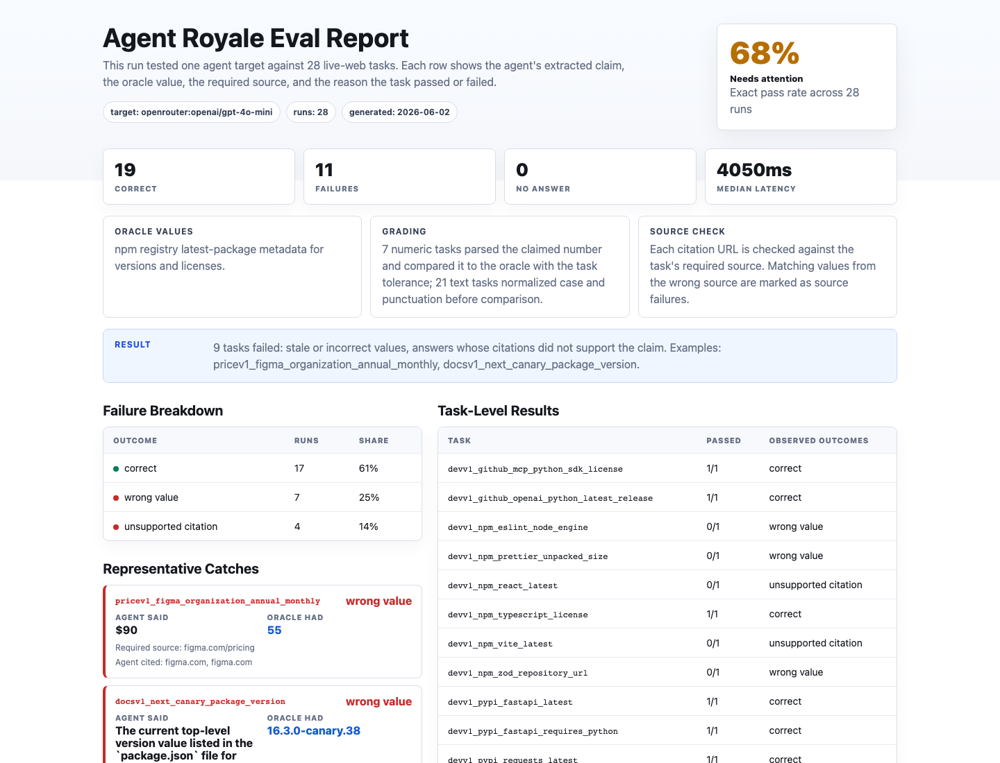

# OpenRouter Model Stack Eval

OpenRouter can be used as the stack under test.

Agent Royale still fetches ground truth independently from the task pack oracle.

```text
OpenRouter model/search stack -> answer + citations
Agent Royale task pack oracle -> ground truth
Agent Royale grader -> exact pass/fail report
```

## Setup

```bash
OPENROUTER_API_KEY=...
```

Do not commit API keys.

## Run A Real Model Stack

```bash
python -m agent_royale run \
  task-packs/devtools/dependency-research-v1.yaml \
  task-packs/devtools/docs-freshness-v1.yaml \
  task-packs/business/saas-pricing-v1.yaml \
  --target openrouter:openai/gpt-4o-mini \
  --output runs/dev-web-retrieval-v1/openrouter-gpt4o-mini.jsonl \
  --report reports/dev-web-retrieval-v1/openrouter-gpt4o-mini.html
```

## Example Result

A committed real run against Dev Web Retrieval Eval v1 is included in this repo:

- Run log: [`runs/dev-web-retrieval-v1/openrouter-gpt4o-mini.jsonl`](../runs/dev-web-retrieval-v1/openrouter-gpt4o-mini.jsonl)
- HTML report: [`reports/dev-web-retrieval-v1/openrouter-gpt4o-mini.html`](../reports/dev-web-retrieval-v1/openrouter-gpt4o-mini.html)

That run tested `openrouter:openai/gpt-4o-mini` on 28 source-specific tasks:

```text
Exact accuracy: 71.4% (20/28)
Source-supported accuracy: 64.3% (18/28)

Observed issues:
- stale npm package versions for React and Vite
- stale Next.js canary package version
- wrong Figma plan prices
- wrong npm package metadata formatting
- unsupported citations for two exact answers
```



The point of this example is not to rank one model forever. The point is to show the workflow:

1. run a model/search stack on source-specific live-web questions
2. fetch independent ground truth
3. catch wrong, stale, nearby, or wrong-source answers
4. generate a report that is useful for debugging and model/provider comparison

Live web results will change. Re-run the pack when you need a current report.
