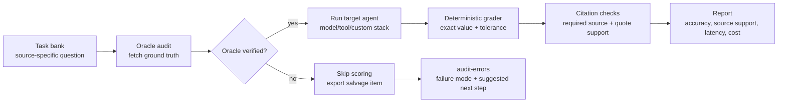
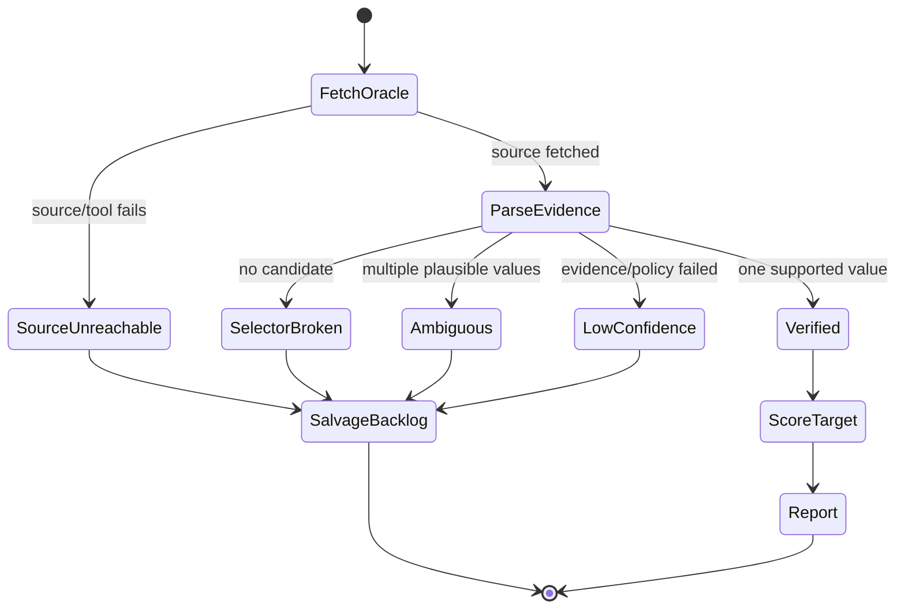
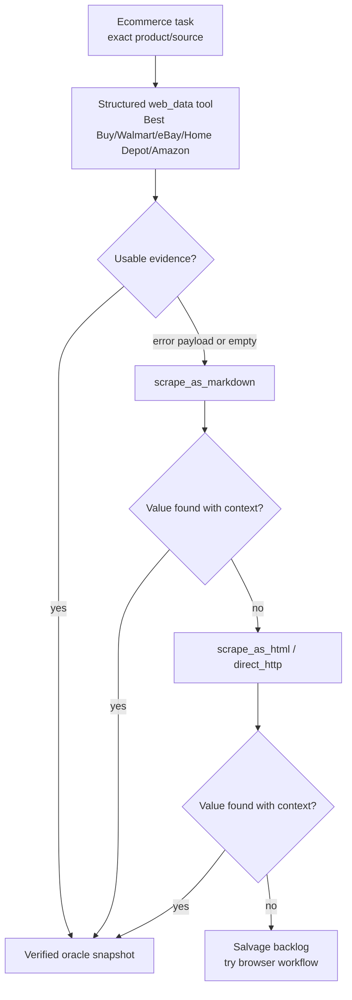

# Reliability Model

Agent Royale is reliable because it separates three jobs that are often blended together in AI demos:

1. Fetch ground truth from an independent oracle.
2. Run the agent or retrieval stack under test.
3. Grade the answer deterministically against the verified oracle value.

The core exact-value grade does not use an LLM judge.

## Trust Pipeline

The target agent never gets credit or blame for a task unless Agent Royale first verifies the ground-truth value.

## What Makes A Task Scoreable

Quarantine means "not safe to score yet," not "delete the user's question." The task stays inspectable with a failure reason and a next extraction path to try.

## Ground-Truth Paths

| Source type | Preferred oracle | Fallback path | Why developers can trust it |
|---|---|---|---|
| npm, PyPI, GitHub, release indexes | `http_json` | none unless the source changes | Reads exact public fields instead of scraped prose. |
| Official docs and README snippets | `http_regex` | tighter regex with `require_near_text` | Captures one exact snippet from the required source. |
| Ecommerce product pages | Bright Data structured ecommerce tool | markdown, HTML, direct HTTP, browser workflow | Tries stronger extraction before quarantining dynamic pages. |
| LinkedIn/company profiles | Bright Data structured profile tool | dataset/profile fallback when configured | Reads named fields such as employees or followers. |
| Smoke tests and examples | `static` | none | Keeps onboarding reproducible without API keys. |

## Bright Data Salvage Routing

This matters for pages like Best Buy where a structured tool may return an error payload as text. Agent Royale treats that as a failed attempt and continues the fallback chain instead of accepting error text as evidence.

## What Reports Prove

| Report field | What it proves | Example failure it catches |
|---|---|---|
| `oracle_status` | Whether ground truth was verified before scoring | Source unreachable, ambiguous value, selector drift |
| `ground_truth_snapshot` | Where the value came from and what evidence supported it | Hidden stale fixture or missing provenance |
| `value_correct` | Whether the claimed value matched the oracle | Wrong version, wrong price, stale count |
| `source_correct` | Whether the answer cited the required source | Correct value from wrong page |
| `citation_supports_claim` | Whether the quote supports the extracted claim | Citation link exists but quote does not contain the value |
| `final_verdict` | Human-readable result bucket | Correct, wrong value, wrong source, unsupported citation |
| `latency_ms` and `cost_usd` | Operational cost of the stack | Accurate but too slow or expensive |
| `task_hash` and pack version | Reproducibility across report runs | Comparing results from mismatched task definitions |

## Failure Modes Are Product Signals

| Failure mode | Meaning | Product action |
|---|---|---|
| `wrong_value` | Agent found a value, but not the verified one | Fix prompt, parser, source choice, or model/tool route. |
| `wrong_source` | Agent cited a source outside policy | Tighten retrieval routing or source filters. |
| `unsupported_citation` | Citation did not support the claim | Require quotes/evidence or change citation extraction. |
| `oracle_ambiguous` | Ground truth had multiple plausible values | Split the task or add narrower source context. |
| `selector_broken` | The oracle parser no longer finds the field | Update the maintained parser instead of loosening scoring. |
| `source_unreachable` | The source/tool path failed | Try structured tools, HTML, browser workflow, or quarantine. |

## Reliability Checklist For New Task Banks

| Check | Command or field | Why it matters |
|---|---|---|
| Validate schema | `python -m agent_royale validate task-packs/<pack>.yaml` | Catches malformed task definitions. |
| Lint task quality | `python -m agent_royale lint task-packs/<pack>.yaml` | Finds fragile regexes, weak source policies, and CI mistakes. |
| Audit oracle health | `python -m agent_royale audit task-packs/<pack>.yaml` | Verifies ground truth before testing an agent. |
| Export salvage report | `python -m agent_royale audit-errors task-packs/<pack>.yaml` | Shows why tasks would be quarantined and how to fix them. |
| Mark volatility | `stability` and `ci_safe` | Prevents fast-changing pages from breaking CI by default. |
| Require source support | `source_policy` | Makes "right answer from wrong source" visible. |

## Summary

Agent Royale is credible because it is strict about what counts:

- Verified ground truth first.
- Deterministic grading second.
- Source and citation checks third.
- Reports that show skipped or quarantined tasks instead of hiding them.

That is the difference between "the model seemed right" and "this stack returned the exact value from the required source."
